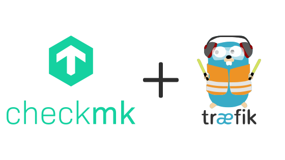

<p align="center">
    
</p>

# Docker Compose Checkmk behind reserve proxy Traefik (Cloudflare)

This guide shows you how to deploy your containers behind Traefik reverse-proxy. It will obtain and refresh `HTTPS` certificates automatically and it comes with password-protected Traefik dashboard.

## Docker container

### Main container

-   Checkmk Raw 2.4.0-latest
-   Traefik Project [Repository](https://github.com/asapdotid/dcc-traefik.git)

### Docker container:

-   Checkmk [Document](https://docs.checkmk.com/latest/en/)
-   Traefik [Document](https://github.com/asapdotid/dcc-traefik.git)

### Step 1: Make Sure You Have Required Dependencies

-   Git
-   Docker
-   Docker Compose

### Step 2: Clone the Repository

# Traefik Docker Compose

```bash
git clone https://github.com/asapdotid/dcc-traefik.git
cd dcc-traefik
# Setup base on README
```

# CheckMk DOcker Compsoe

```bash
git clone https://github.com/asapdotid/dcc-checkmk.git
cd dcc-checkmk
# Setup base on README
```

Make command help:

```bash
make help
```

### Step 3: Make Initial Environment Variables

```bash
make init
```

Modified file in `.make/.env` for build image

```ini
...
# Project variables
DOCKER_REGISTRY=docker.io
DOCKER_NAMESPACE=checkmk
DOCKER_IMAGE=check-mk-raw
DOCKER_IMAGE_VERSION=2.4.0-latest
DOCKER_PROJECT_NAME=monitoring
```

### Step 3: Make Docker Compose Initial Environment Variables

```bash
make env
```

Modified file in `src/.env` for build image

### Step 4: Set Your Environments

Set both Checkmk and Traefik in `src/.env`

#### Checkmk envs

```ini
# docker-compose env vars
## CHECKMK ENVS
TZ=Asia/Jakarta
CMK_USER_ID=1000
CMK_GROUP_ID=1000
CMK_SITE_ID=cmk
CMK_PASSWORD=JYg0ZDYu23451
CMK_LIVESTATUS_TCP=on
CMK_SET_DOMAIN_NAME=cmk.jogjascript.com
CMK_TRAEFIK_ENTRYPOINTS=websecure
```

### Step 5: Test Your Deployment

```bash
curl -I https://{domain_name}/
```

You can also test it in the browser:

-   Checkmk dashboard: `https://cmk.{domain_name}/`
-   Traefik dashboard: `https://monitor.{domain_name}/`

## License

MIT / BSD

## Author Information

This Docker Compose Checkmk + Traefik was created in 2025 by [Asapdotid](https://github.com/asapdotid) 🚀
